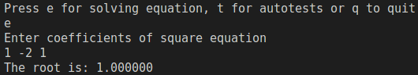
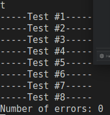
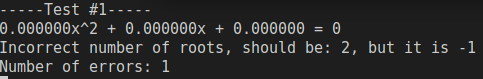

## Description
This program can solve square equations

## Build & Run
### Build
```bash
make
```
### Run
```bash
./build/square
```

## Usage
- press e + enter, then enter three numbers - coefficients of square equation in form `ax^2 + bx + c = 0` to solve square equation
- press t + enter to run automatic tests (check Autotests for file format)
- press q + enter to quit

## Examples
Example of manually entered equation



Example of autotests (all passed)



Example of autotests (failed - broken test)



## Autotests
- in file named input.txt first line contains one number N
- next N lines contains 4-6 numbers, first 3 are coefficients a, b, c of square equation in form `ax^2 + bx + c = 0`, then n - number of roots, then roots from lesser to higher

## Docs
[docs](https://vlad-cool.github.io/Kvadratka/pages.html)

## Authors
Created by (c) Vlad Matveev on Ded`s summer school 2022
